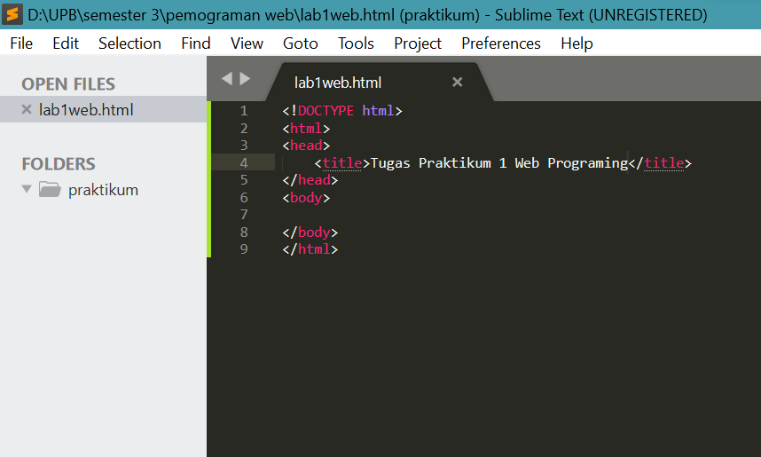
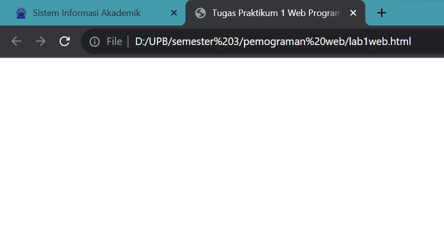
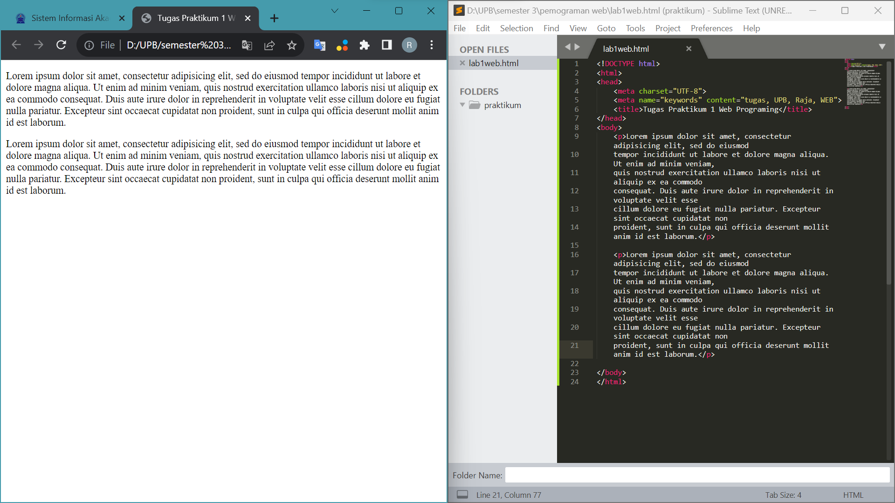
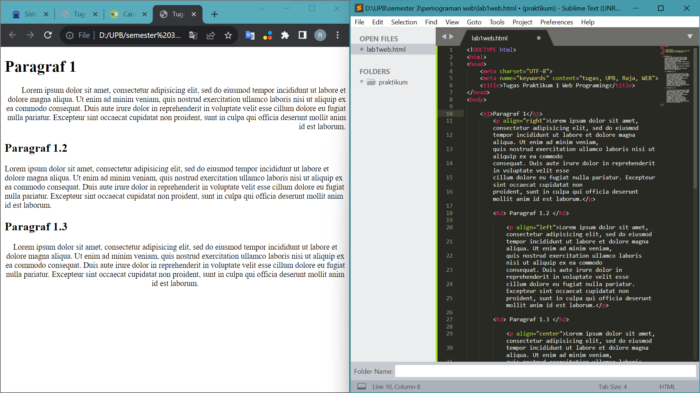
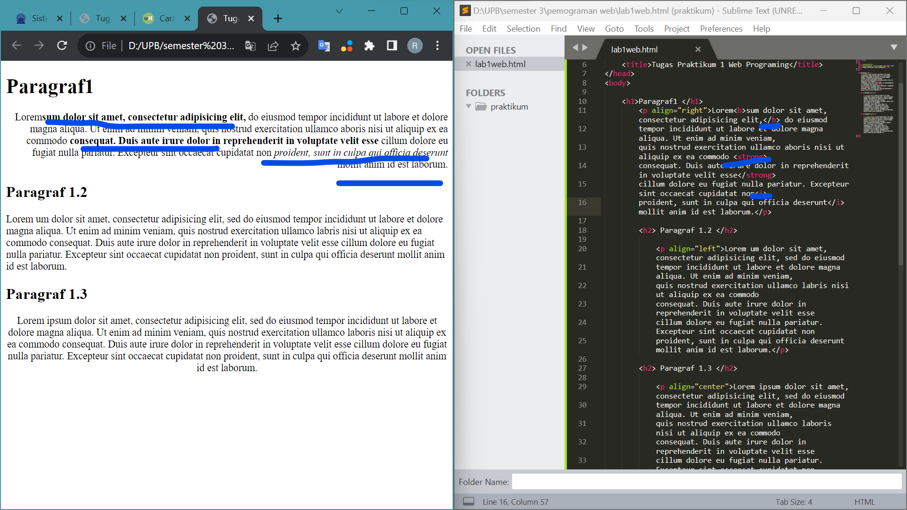
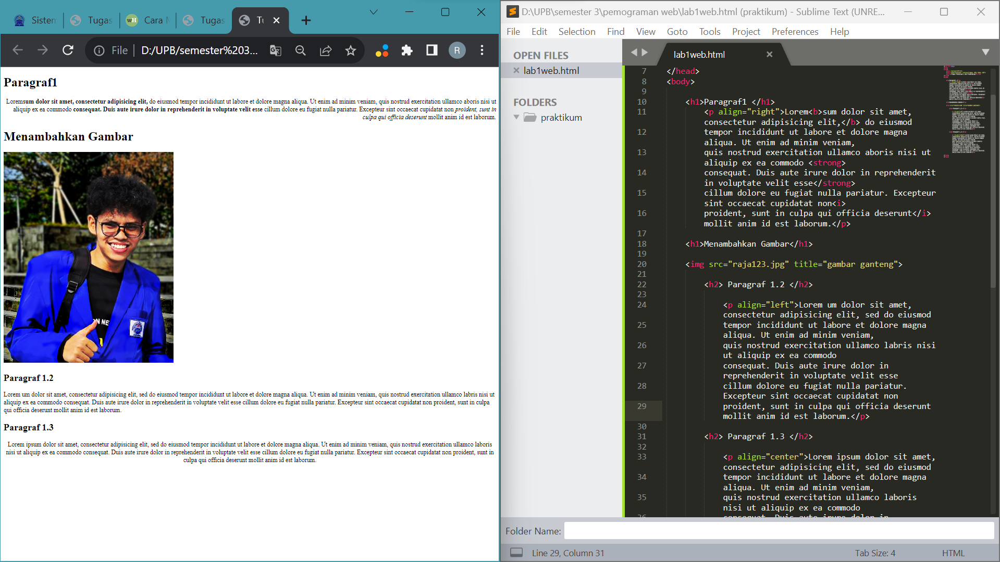
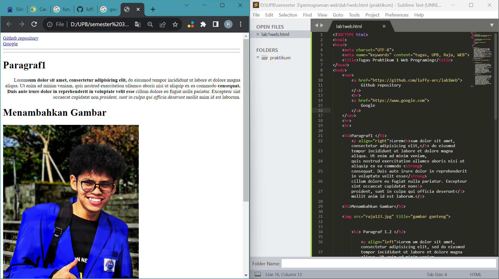

# lab1Web

### Tugas Pemograman web praktikum1
```
Nama : raja happyanto
Kelas : TI.22.A2
```

### penjelasan

#### Struktur dasar HTML

Stuktur dasar HTML terdiri dari  tag DTD atau DOCTYPE, tag html, tag head, dan tag body
```
Code
```

```
hasil
```


#### 1. Menambahkan Paragraf 

Untuk menambahakan paragraf kita mengguakan tag
``` <p> </p> ```
contoh



atribut dalam tag paragraf untuk mengatur rata text adalah atribut align dengan perintah right, left, center dan justify

#### 2. Menambah Judul

menambahkan judul menggunakan tag h 
dari h1. h2, h2 sampai h6 gunakan sesuai kebutuhan
```
<h1></h1> <h2></h2> <h3></h3> <h4></h4> <h5></h5> <h6></h6>
```
contoh 



#### 3. memformat text 

text pada html dapat di format menjadi italic, bold , strong dll

menggunakan tad 
```<b></b>, <i></i> ``` dll

contoh



#### 4. Menambahkan gambar 

untuk menambahkan gambar dapat menggunakan tag img

tambahkan nama folder jika gambar tersebut tersimpan pada folder yang berbeda, jika tidak cukup tuliskan sesuai tag 
. tambahkan juga atribut title di belakang tag untuk memberi nama gambar, nama ini akan muncul ketika kursor di arahkan ke gambar pada web broser

```

```
contoh



#### 5. menambahkan hyperlink

untuk menambahakan hyper link cukup menggunakan tag a dan sisipkan link tujuan di dalamnya
```
<a href="link">nama yang akan muncul di web</a>
```
contoh 



### Sekian Penjelasan latihan

### Jawab pertanyaan

1. Lakukan perubahan pada kode sesuai dengan keinginan anda, amati perubahannya adakah
error ketika terjadi kesalahan penulisan tag?
```
jawab : Tidak

```
2. Apa perbedaan dari tag <p> dengan tag <br>, berikan penjelasannya!
```
jawab : tag p diawali pembuka dan penutup sedangkan br tidak, 
tag br memang dapat membuat paragraf baru tapi lebih di fungsikan untuk menambah bari baru dan membatu tag p karena akan sulit memberikan atribut align pada tag br
```
3. Apa perbedaan atribut title dan alt pada tag , berikan penjelasannya!
```
jawab : alt di tujukan untuk memberikan deskripsi pd gambar sedangkan title berupa tooltip yang akan muncul saat kursor di arahkan ke gambar
```
4. Untuk mengatur ukuran gambar, digunakan atribut width dan height. Agar tampilan gambar
proporsional sebaiknya kedua atribut tersebut diisi semua atau tidak? Berikan penjelasannya!
```
jawab : Tidak
itu akan bergantung pada gambar yang kita unggah, karena nilai pada width dan height akan menimbulkan distorsi pada gambar apa bila memberikan pixel yang berbeda,
keduanya hanya harus di isi jika gambar yang akan kita upload bentuknya kurang proporsional
```
5. Pada link tambahkan atribut target dengan nilai atribut bervariasi ( _blank, _self, _top,
_parent ), apa yang terjadi pada masing-masing nilai antribut tersebut?
```
jawab : blank akan membuat link di buka di tab/jendela baru
self akan membuka link pada halaman baru
top akan membuka halaman pada tab/jenjela ter atas
parent akan membuka halaman di frame induk

```

### Sekian terima kasihh